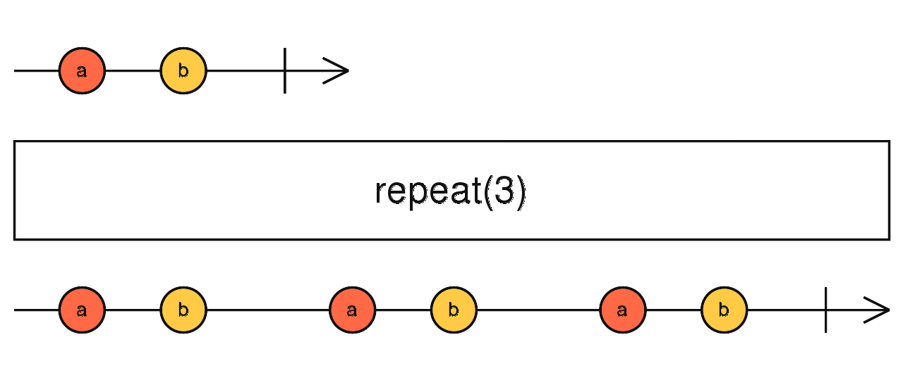
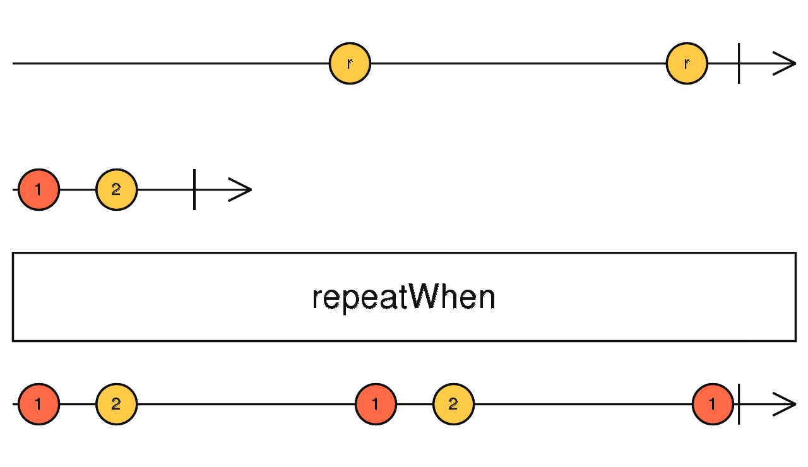
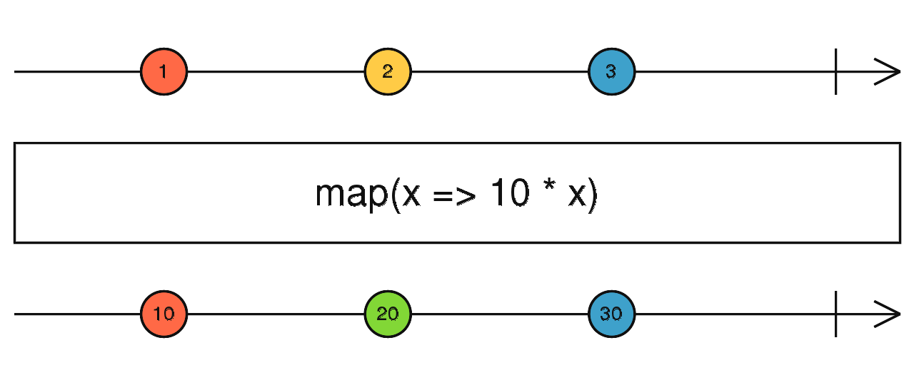
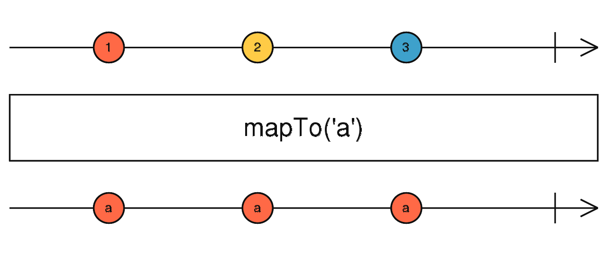
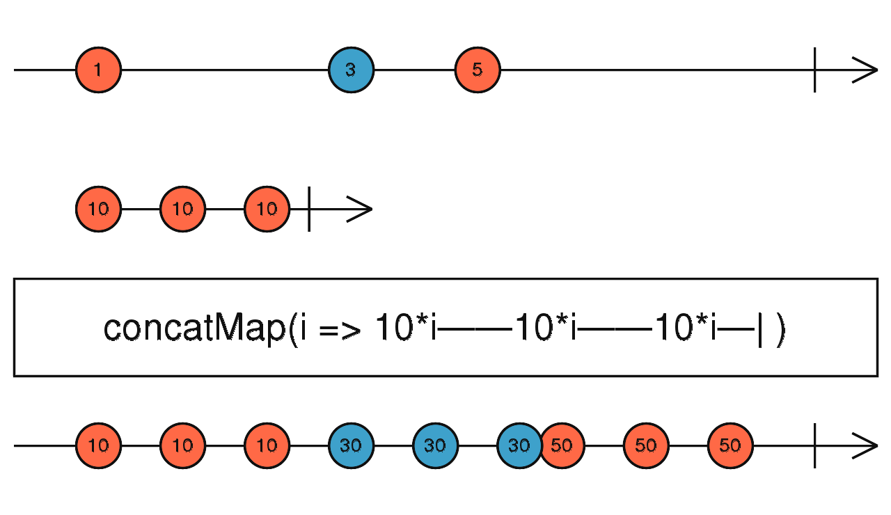
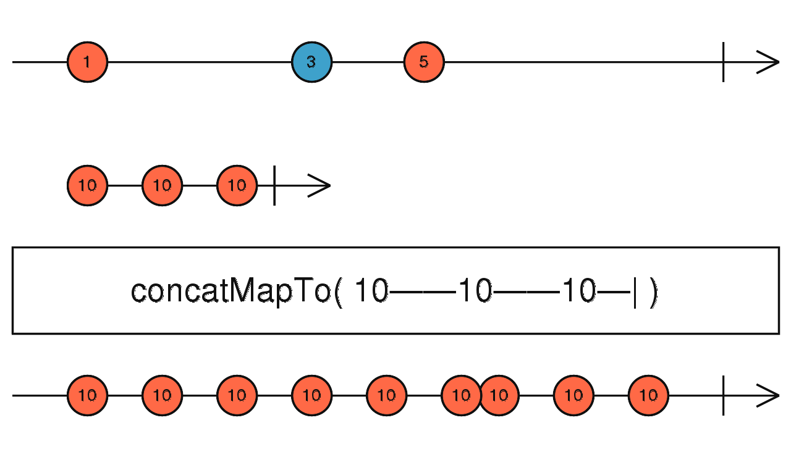
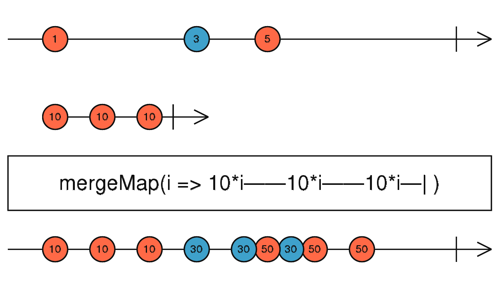
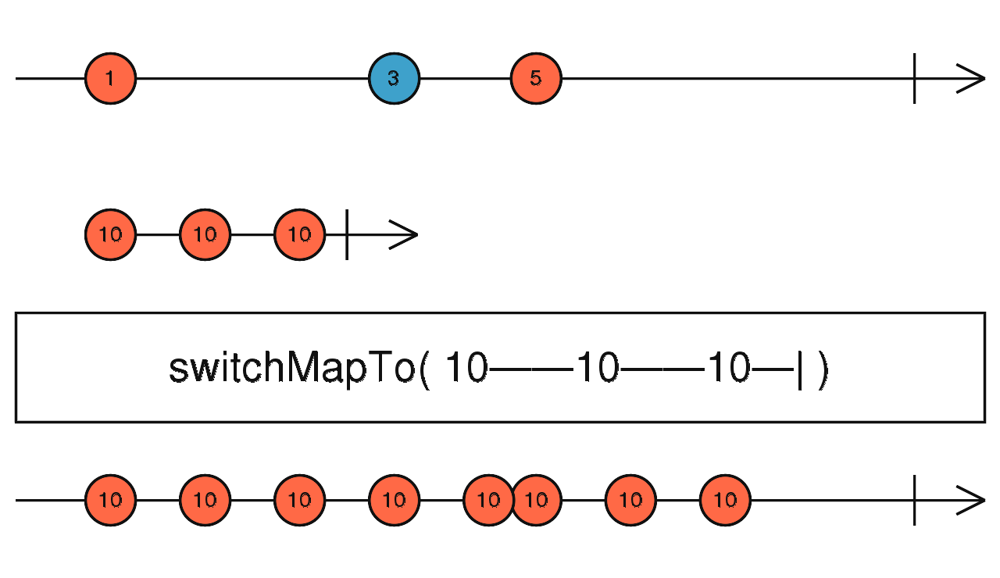
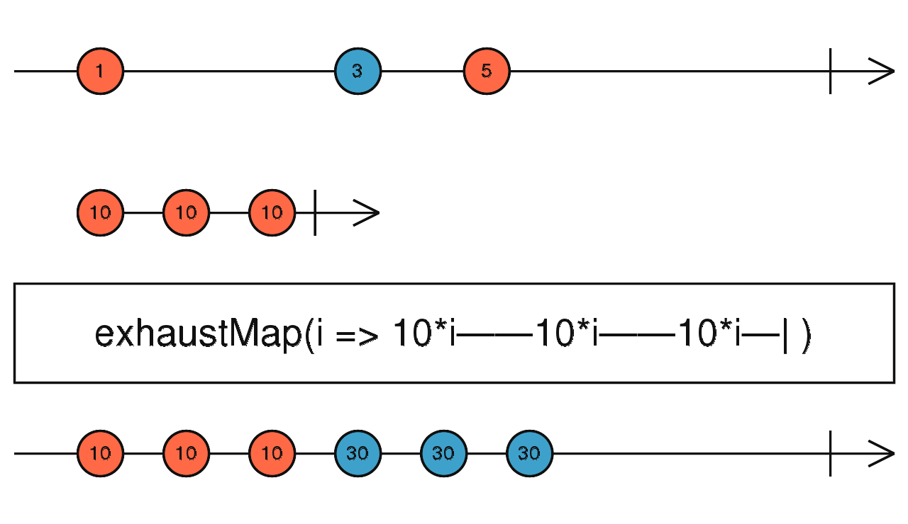

# RxJS

RxJS 主要元素有

* Observable：代表一系列的資料或是事件
* Observer：用來監聽 Observable 所發生的值
* Subscription：代表 Observable 的訂閱ID，主要目的是用來取消 Observable
* Operators：pure function, 提供一系列的功能可以操作 Observable
* Subject：等同於 EventEmitter，處理 multicasting 的唯一方法
* Schedulers

在這章節會詳細的一一介紹及提供可能使用情境

# Observable

## 解析 Observable

Observable 的執行生命週期是建立 ( creating )、訂閱 ( subscribing) 、 執行 ( executing )、回收 ( disposing )，一個完整的 Observable 都會經歷這四個階段

* 建立 Observable

  ```typescript
  var observable = Observable.create(observer => {
    var id = setInterval(() => {
      observer.next('hi')
    }, 1000);
  });
  ```

  RxJS 提供很多方法可以用來建立 Observable，會在之後的內容逐一介紹

* 訂閱 Observable

  ```typescript
  observable.subscribe({
    next: x => console.log('Observer got a next value: ' + x),
    error: err => console.error('Observer got an error: ' + err),
    complete: () => console.log('Observer got a complete notification'),
  });
  ```

  `subscribe` 是訂閱 Observable 的動作，會接收一個 observer 物件 (包含 next、error、complete 三階段)，會是接收三個函式，分別處理 next、error、complete 三個階段。在執行 `subscribe` 時，會回傳一個 `subscription`，這個 `subscription` 是用來取消 Observable 使用的

* 執行 Observable

  * 剛剛有提過 subscribe 內會有三個階段要處理，分別為 next、error、complete
    * next：Observable 正常執行時，任何值都會傳給負責處理 next 階段的函式
    * error：當 Observable 發生錯誤時，就會進入 error 階段，負責的函式也會收到一個參數
    * complete：當 Observable 正常執行結束後，就會進入 complete 階段，不會接受到任何參數
  * 一但進入 error 或是 complete 階段，即使 Observable 後續還有任何資料的發生，next 階段都不會接受到任何資料了。( RxJS 有提供 operators 可以負責處理 error 階段的函式，並可以切回正常階段 )

* 回收 Observable

  * 訂閱 Observable 會收到一個 subscription，執行 `unsubscribe()` 即可取消 Observable 的動作

    ```typescript
    var observable = Observable.from([10, 20, 30]);
    var subscription = observable.subscribe(x => console.log(x));
    // Later:
    subscription.unsubscribe();
    ```

# Operators

Operators 都屬 `pure function`，RxJS 要用的好，很大的因素在於 operators 的掌握及熟悉度，對 operators 越熟悉，RxJS 的威力越可以展現出來，但不要急，花點時間練習就可以掌握了。

Operators 主要分為 `creation`、 `transformation`、 `filtering`、 `combination`、 `multicasting`、 `error handling`、 `utility` 等類別，每個類別的功能及目的都不太一樣，有些 operators 會是其他 operators 的混搭版，之後會更仔細的說明。

## Creation Operators

### ajax

透過 Observable.ajax 可以呼叫 api 並取回資料，底層是使用 XMLHttpRequest 的方式實作。

```typescript
Observable.ajax('/products');
Observable.ajax({ url: 'products', method: 'GET' }); // 可接受 option 物件
```

參數物件內有以下設定可使用

* url
* body
* method：GET、POST、PUT、PATCH、DELETE
* async
* headers
* crossDomain： true / false
* createXHR
* resultSelector

**使用範例**

```typescript
Observable
  .ajax('https://jsonplaceholder.typicode.com/posts')
  .map(e => e.response)
  .subscribe(posts => console.log(posts));
```


### bindCallback

將 callback API 轉換成一個回傳 Observable 的函式

**使用介面**

```typescript
bindCallback(func: function, selector: function, scheduler: Scheduler): function(...params: *): Observable
```

**使用範例**

```typescript
function callbackFn(value1, value2, callback) {
  // value1 output: 1;
  // value2 output: 2;
  callback(value1, value2);
}

let source = Observable.bindCallback(callbackFn, (value1, value2) => {
  // value1 receive: 1;
  // value2 receive: 2;
  return value1 + value2;
});

source(1, 2).subscribe(value => {
  // value output: 2;
  console.log(value);
});
```

### bindNodeCallback

`bindNodeCallback` 與 `bindCallback` 的用法是一樣的，但是針對 node.js-style callback

**使用介面**

```typescript
bindNodeCallback(func: function, selector: function, scheduler: Scheduler): function(...params: *): Observable
```


**使用範例**

```typescript
import * as fs from 'fs';
// fs.readFile('/etc/passwd', 'utf8', callback);

var readFileAsObservable = Observable.bindNodeCallback(fs.readFile);
var result = readFileAsObservable('./roadNames.txt', 'utf8');
result.subscribe(x => console.log(x), e => console.error(e));
```

### create

建立自訂 Observable，`create` 會送出一個 observer 物件，包含 `next`、`error`、`complete` 三個函式。


透過這三個函式來控制 Observable 資料的輸出

1. next：送出資料
2. error：送出錯誤訊息，之後就會結束 Observable
3. complete：結束 Observable，之後不會有任何輸出值

```typescript
var observable = Observable.create(function (observer) {
  observer.next(1);
  observer.next(2);
  observer.next(3);
  observer.complete();
});
observable.subscribe(
  value => console.log(value),
  err => {},
  () => console.log('this is the end')
);
```

```typescript
const observable = Observable.create((observer) => {
  observer.error('something went really wrong...');
});

observable.subscribe(
  value => console.log(value), // will never be called
  err => console.log(err),
  () => console.log('complete') // will never be called
);
```

### defer

`defer` 是 Observable 工廠，`defer` 接受傳入一個會回傳 Observable 或是 Promise 的函式


**使用介面**

```typescript
defer(observableFactory: function(): SubscribableOrPromise): Observable
```

**使用範例**

```typescript
const clicksOrInterval = Observable.defer(function () {
  if (Math.random() > 0.5) {
    return Observable.fromEvent(document, 'click');
  } else {
    return Observable.interval(1000);
  }
});
clicksOrInterval.subscribe(x => console.log(x));
```

### from

接受陣列，Promise 或是可以 iterable 物件資料並轉換成 Observable (串流模式)


**使用介面**

```typescript
from(ish: ObservableInput<T>, scheduler: Scheduler): Observable<T>
```

**使用範例**

```typescript
// 轉換陣列
var array = [10, 20, 30];
var result = Rx.Observable.from(array);
result.subscribe(x => console.log(x)); // 依序輸出 10, 20, 30
```

```typescript
// 轉換 generator function 
function* generateDoubles(seed) {
  var i = seed;
  while (true) {
    yield i;
    i = 2 * i; // double it
  }
}

var iterator = generateDoubles(3);
var result = Rx.Observable.from(iterator).take(10);
result.subscribe(x => console.log(x));
```

### fromEvent

轉換 Dom events 、Node EventEmitter events 或其他的事件至 Observable


**使用介面**

```typescript
fromEvent(target: EventTargetLike, eventName: string, options: EventListenerOptions, selector: SelectorMethodSignature<T>): Observable<T>
```

**使用範例**

```typescript
var clicks = Rx.Observable.fromEvent(document, 'click');
clicks.subscribe(x => console.log(x));
```

### fromEventPattern

轉換 `addHandler` 和 `removeHandler` 至 Observable，會在 subscribe 時執行 addHandler 函式，而在 unsubscribe 時執行 removeHandler 函式


**使用介面**

```typescript
fromEventPattern(addHandler: function(handler: Function): any, removeHandler: function(handler: Function, signal?: any): void, selector: function(...args: any): T): Observable<T>
```

**使用範例**

```typescript
function addClickHandler(handler) {
  console.log('add click event listener');
  document.addEventListener('click', handler);
}

function removeClickHandler(handler) {
  console.log('remove click event listener');
  document.removeEventListener('click', handler);
}

var clicks = Rx.Observable.fromEventPattern(
  addClickHandler,
  removeClickHandler
);
clicks.take(5).subscribe(x => console.log(x));
```

### fromPromise

轉換 promise 至 observable

**使用介面**

```typescript
fromPromise(promise: Promise<T>, scheduler: Scheduler): Observable<T>
```

**使用範例**

```typescript
var result = Rx.Observable.fromPromise(fetch('https://jsonplaceholder.typicode.com/users'));
result.subscribe(x => console.log(x), e => console.error(e));
```

### interval

建立一個會定時( ms )發送資料的 Observable


**使用介面**

```typescript
interval(period: number, scheduler: Scheduler): Observable
```

**使用範例**

```typescript
var numbers = Rx.Observable.interval(1000);
numbers.subscribe(x => console.log(x));
```

### never

建立一個不會發送任何資料的 Observable，主要為測試用途。


**使用介面**

```typescript
never(): Observable
```

**使用範例**

```typescript
function info() {
  console.log('Will not be called');
}
var result = Observable.never().startWith(7);
result.subscribe(x => console.log(x), info, info);
```

### empty

直接回傳 `complete` 的 observable，主要為測試用途。


**使用介面**

```typescript
empty(scheduler: Scheduler): Observable
```

**使用範例**

```typescript
var interval = Rx.Observable.interval(1000);
var result = interval.mergeMap(x =>
  x % 2 === 1 ? Rx.Observable.of('a', 'b', 'c') : Rx.Observable.empty()
);
result.subscribe(x => console.log(x));
```

### throw

回傳 `error` 的 observable


**使用介面**

```typescript
throw(error: any, scheduler: Scheduler): Observable
```

**使用範例**

```typescript
var interval = Rx.Observable.interval(1000);
var result = interval.mergeMap(x =>
  x === 13 ?
    Rx.Observable.throw('Thirteens are bad') :
    Rx.Observable.of('a', 'b', 'c')
);
result.subscribe(x => console.log(x), e => console.error(e));
```

### of

回傳一系列資料的 Observable


**使用介面**

```typescript
of(values: ...T, scheduler: Scheduler): Observable<T>
```

**使用範例**

```typescript
// Emit 10, 20, 30, then 'a', 'b', 'c', then start ticking every second.
var numbers = Rx.Observable.of(10, 20, 30);
var letters = Rx.Observable.of('a', 'b', 'c');
var interval = Rx.Observable.interval(1000);
var result = numbers.concat(letters).concat(interval);
result.subscribe(x => console.log(x));
```

### repeat

重複執行原有的 Observable n 次



**使用介面**

```typescript
repeat(count: number): Observable
```

* count：重複次數

**使用範例**

```typescript
const source = Observable.of(1,2).repeat(2);
source.subscribe(x=> console.log(x)); // 輸出：1, 2, 1, 2
```

```typescript
// 兩次 repeat 會相乘等於重複 4 次
const source = Observable.of(1,2).repeat(2).repeat(2);
source.subscribe(x=> console.log(x)); // 輸出：1, 2, 1, 2, 1, 2, 1,2
```

### repeatWhen

根據 notifications 來決定重複的時機，可以利用 `complete` 或 `error` 來取消重複執行的動作



**使用介面**

```typescript
repeatWhen(notifier: function(notifications: Observable): Observable): Observable
```

* notifier：決定是否要重複執行原有的 Observable

**使用範例**

```typescript
let retried = false;
const source =
    Observable.of(1, 2).repeatWhen(function (notifications) {         
        return notifications.map(function (x) {            
        if (retried) {
            throw new Error('done');
        }
        retried = true;
        return x;
    }); })
source.subscribe(x => console.log(x));

```

### range

一個 Observable 經設定開始與數量後，可以產生一系列的數列資料


**使用介面**

```typescript
range(start: number, count: number, scheduler: Scheduler): Observable
```

* start：起始值，預設：0
* count： 數列長度，預設：0

**使用範例**

```typescript
var numbers = Rx.Observable.range(1, 10);
numbers.subscribe(x => console.log(x));
```

### timer

是 interval + delay 組合功能的 Observable


**使用介面**

```typescript
timer(initialDelay: number | Date, period: number, scheduler: Scheduler): Observable
```

* initialDelay：延遲時間
* period：發送資料頻率 (ms)

**使用範例**

```typescript
// 延遲 3 秒後，每隔 1 秒發送一次
var numbers = Rx.Observable.timer(3000, 1000);
numbers.subscribe(x => console.log(x));
```


## Transformation Operators

### map

根據資料轉型的函式，將 Observable 發出的資料做轉型



**使用介面**

```typescript
map(project: function(value: T, index: number): R, thisArg: any): Observable<R>
```

**使用範例**

```typescript
Observable.of(1, 2, 3, 4, 5)
    .map((value, idx) => {
      return value * (idx % 2 == 0 ? 1 : 2);
    })
    .subscribe(value => console.log(value)); // 輸出: 1, 4, 3, 8, 5
```

※ `map` 是 RxJS 使用最頻繁之一的 operators

### mapTo

送出一個固定的值



**使用介面**

```typescript
mapTo(value: any): Observable
```

**使用範例**

```typescript
Observable.of(1, 2, 3, 4, 5)
    .mapTo('Hi')
    .subscribe(value => console.log(value)); // 輸出：Hi, Hi, Hi, Hi, Hi
```

### concatMap

依序地結合兩個 Observable 發出的資料並做轉換



**使用介面**

```typescript
concatMap(project: function(value: T, ?index: number): ObservableInput, resultSelector: function(outerValue: T, innerValue: I, outerIndex: number, innerIndex: number): any): Observable source
```

**使用範例**

```typescript
Observable.of(1, 2, 3, 4, 5)
    .concatMap(
        (value, idx) => {
          const _v = value * (idx % 2 == 0 ? 1 : 2);
          return Observable.of(_v);// 輸出：1, 4, 3, 8, 5
        },
        (outerValue, innerValue) => {
          console.log({outValue, innerValue}); // 輸出：{1,1},{2,4},{3,3},{4,8},{5,5}
          return outerValue * innerValue
        })
    .subscribe(value => console.log(value));// 輸出：1, 8, 9, 32, 25
```

### concatMapTo

依序地結合兩個 Observable 並送出一個固定的值



**使用介面**

```typescript
concatMapTo(innerObservable: ObservableInput, resultSelector: function(outerValue: T, innerValue: I, outerIndex: number, innerIndex: number): any): Observable
```

**使用範例**

```typescript
Observable.of(1,2,3,4,5)
    .concatMapTo(
        Observable.of('Hi'),
        (outerValue, innerValue) => {
          return innerValue + ' ' + outerValue;
        })
    .subscribe(value => console.log(value)); // 輸出: Hi 1, Hi 2, Hi 3, Hi 4, Hi 5
```

### mergeMap

依資料發生的時序結合兩個 Observable 並做資料轉換



**使用介面**

```typescript
mergeMap(project: function(value: T, ?index: number): ObservableInput, resultSelector: function(outerValue: T, innerValue: I, outerIndex: number, innerIndex: number): any, concurrent: number): Observable
```

**使用範例**

```typescript
Observable.of(1, 2, 3, 4, 5)
    .mergeMap(
        (value, idx) => {
          const _v = value * (idx % 2 == 0 ? 1 : 2);
          return Observable.of(_v);// 輸出：1, 4, 3, 8, 5
        },
        (outerValue, innerValue) => {
          console.log({outerValue, innerValue}); // 輸出：{1,1},{2,4},{3,3},{4,8},{5,5}
          return outerValue * innerValue
        })
    .subscribe(value => console.log(value));// 輸出：1, 8, 9, 32, 25
```


### mergeMapTo

依資料發生的時序結合兩個 Observable 並送出一個固定的值


**使用介面**

```typescript
 mergeMapTo(innerObservable: ObservableInput, resultSelector: function(outerValue: T, innerValue: I, outerIndex: number, innerIndex: number): any, concurrent: number): Observable
```

**使用範例**

```typescript
Observable.of(1,2,3,4,5)
    .mergeMapTo(
        Observable.of('Hi'),
        (outerValue, innerValue) => {
          return innerValue + ' ' + outerValue;
        })
    .subscribe(value => console.log(value)); // 輸出: Hi 1, Hi 2, Hi 3, Hi 4, Hi 5
```

### switchMap

取最新發生的資料合併兩個 Observable 並做轉換


**使用介面**

```typescript
switchMap(project: function(value: T, ?index: number): ObservableInput, resultSelector: function(outerValue: T, innerValue: I, outerIndex: number, innerIndex: number): any): Observable
```

**使用範例**

```typescript
const clicks = Rx.Observable.fromEvent(document, 'click');
const result = clicks.switchMap((ev) => Rx.Observable.interval(1000));
result.subscribe(x => console.log(x));
```

在每一次 click 動作重新執行 Observable.interval 的動作

### switchMapTo

就跟 `switchMap` 一樣，只是每次都回傳一樣的值



**使用介面**

```typescript
switchMapTo(innerObservable: ObservableInput, resultSelector: function(outerValue: T, innerValue: I, outerIndex: number, innerIndex: number): any): Observable
```

**使用範例**

```typescript
var clicks = Rx.Observable.fromEvent(document, 'click');
var result = clicks.switchMapTo(Rx.Observable.interval(1000));
result.subscribe(x => console.log(x));
```

### exhaustMap

如果在上一個 Observable 動作未完成，又發生另一個 observable 動作，則這一個動作會被忽略。



**使用介面**

```typescript
exhaustMap(project: function(value: T, ?index: number): ObservableInput, resultSelector: function(outerValue: T, innerValue: I, outerIndex: number, innerIndex: number): any): Observable
```

**使用範例**

```typescript
var clicks = Rx.Observable.fromEvent(document, 'click');
var result = clicks.exhaustMap(Rx.Observable.interval(1000));
result.subscribe(x => console.log(x));
```

### expand


**使用介面**

```typescript
expand(project: function(value: T, index: number), concurrent: number, scheduler: Scheduler): Observable
```

**使用範例**

```typescript
Observable.of(1, 2)
    .expand((value: number) => {
      if (value === 8)
        return Observable.empty();
      else
        return Observable.of(value * 2);
    })
    .subscribe(x => console.log(x)); // 輸出 1, 2, 4, 8, 2, 4, 8
```

### groupBy

### mergeScan

### pairwise

### partition

### pluck

### scan

### buffer

### bufferCount

### bufferTime

### bufferToggle

### bufferWhen

### window

### windowCount

### windowCount

### windowTime

### windowToggle

### windowWhen

## Filtering Operators

## Combination Operators

## Multicasting Operators

## Error Handling Operators

## Utility Operators

## Conditional and Boolean Operators

## Mathematical and Aggregate Operators


# Subject

# Schedulers


