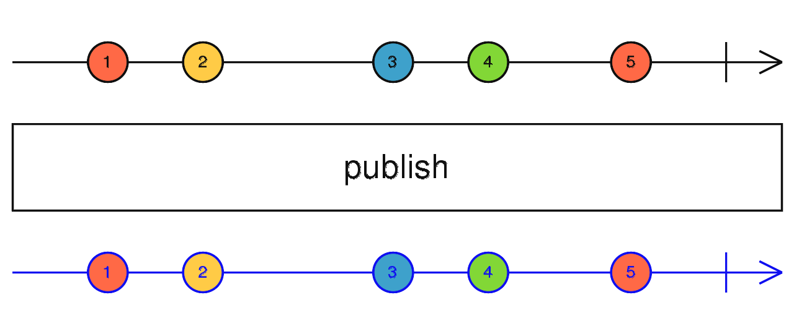
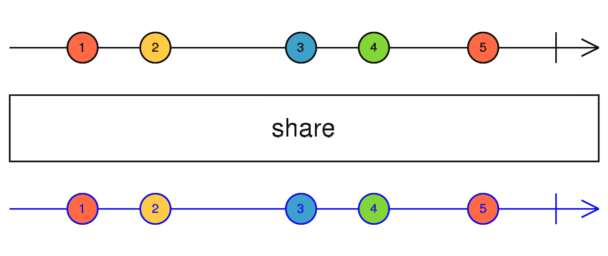

# Subject

subject 是一個很特別的東西，他同時間是 observable 也是 observer。可以管理多個 observable ，也可以同時發送資料到多個 observe 。主要的用途是 `multicast`

## subject種類

Subject 有 `Subject`、`BehaviorSubject`、`ReplaySubject` 和 `AsyncSubject` ，每一個 subject 都有各自的特性，以下一一介紹

## Multicasted Observables 

這小節會用 subject 來解釋什麼是 multicast


## BehaviorSubject

## ReplaySubject

## AsyncSubject


## Multicasting Operators

### multicast

要達到 multicast 的效果，所以會回傳一個 subject (任何類型的 subject)


**使用介面**

```typescript
multicast(subjectOrSubjectFactory: Function | Subject, selector: Function): Observable
```

**使用範例**

```typescript
let multicasted = source.multicast(()=> new Subject());
multicasted.connect(); // 開始運作
```

### publish

publish 是 multicast 輸出 subject 的縮寫



**使用介面**

```typescript
 publish(selector: Function): *
```

**使用範例**

```typescript
let multicasted = source.publish();
multicasted.connect(); // 開始運作
```

### publishBehavior

publish 是 multicast 輸出 BehaviorSubject 的縮寫

### publishLast

publish 是 multicast 輸出 AsyncSubject 的縮寫

### publishReplay

publish 是 multicast 輸出 ReplaySubject 的縮寫

### share

share 是 publish 加上 refCount 的縮寫



**使用介面**

```typescript
share(): Observable<T>
```

**使用範例**

```typescript
let source = Observable.ajax(url).share();
```


## shareReplay

share 是 publishReplay 加上 refCount 的縮寫

**使用介面**

```typescript
shareReplay<T>(this: Observable<T>, bufferSize?: number, windowTime?: number, scheduler?: IScheduler): Observable<T>;
```

**使用範例**

```typescript
let source = Observable.ajax(url).shareReplay(3,2);
```


