# Transformation Operators

## map

根據資料轉型的函式，將 Observable 發出的資料做轉型


**使用介面**

```typescript
map(project: function(value: T, index: number): R, thisArg: any): Observable<R>
```

**使用範例**

```typescript
Observable.of(1, 2, 3, 4, 5)
    .map((value, idx) => {
      return value * (idx % 2 == 0 ? 1 : 2);
    })
    .subscribe(value => console.log(value)); // 輸出: 1, 4, 3, 8, 5
```

※ `map` 是 RxJS 使用最頻繁之一的 operators

## mapTo

送出一個固定的值


**使用介面**

```typescript
mapTo(value: any): Observable
```

**使用範例**

```typescript
Observable.of(1, 2, 3, 4, 5)
    .mapTo('Hi')
    .subscribe(value => console.log(value)); // 輸出：Hi, Hi, Hi, Hi, Hi
```

## concatMap

依序地結合兩個 Observable 發出的資料並做轉換


**使用介面**

```typescript
concatMap(project: function(value: T, ?index: number): ObservableInput, resultSelector: function(outerValue: T, innerValue: I, outerIndex: number, innerIndex: number): any): Observable source
```

**使用範例**

```typescript
Observable.of(1, 2, 3, 4, 5)
    .concatMap(
        (value, idx) => {
          const _v = value * (idx % 2 == 0 ? 1 : 2);
          return Observable.of(_v);// 輸出：1, 4, 3, 8, 5
        },
        (outerValue, innerValue) => {
          console.log({outValue, innerValue}); // 輸出：{1,1},{2,4},{3,3},{4,8},{5,5}
          return outerValue * innerValue
        })
    .subscribe(value => console.log(value));// 輸出：1, 8, 9, 32, 25
```

## concatMapTo

依序地結合兩個 Observable 並送出一個固定的值


**使用介面**

```typescript
concatMapTo(innerObservable: ObservableInput, resultSelector: function(outerValue: T, innerValue: I, outerIndex: number, innerIndex: number): any): Observable
```

**使用範例**

```typescript
Observable.of(1,2,3,4,5)
    .concatMapTo(
        Observable.of('Hi'),
        (outerValue, innerValue) => {
          return innerValue + ' ' + outerValue;
        })
    .subscribe(value => console.log(value)); // 輸出: Hi 1, Hi 2, Hi 3, Hi 4, Hi 5
```

## mergeMap

依資料發生的時序結合兩個 Observable 並做資料轉換


**使用介面**

```typescript
mergeMap(project: function(value: T, ?index: number): ObservableInput, resultSelector: function(outerValue: T, innerValue: I, outerIndex: number, innerIndex: number): any, concurrent: number): Observable
```

**使用範例**

```typescript
Observable.of(1, 2, 3, 4, 5)
    .mergeMap(
        (value, idx) => {
          const _v = value * (idx % 2 == 0 ? 1 : 2);
          return Observable.of(_v);// 輸出：1, 4, 3, 8, 5
        },
        (outerValue, innerValue) => {
          console.log({outerValue, innerValue}); // 輸出：{1,1},{2,4},{3,3},{4,8},{5,5}
          return outerValue * innerValue
        })
    .subscribe(value => console.log(value));// 輸出：1, 8, 9, 32, 25
```


## mergeMapTo

依資料發生的時序結合兩個 Observable 並送出一個固定的值

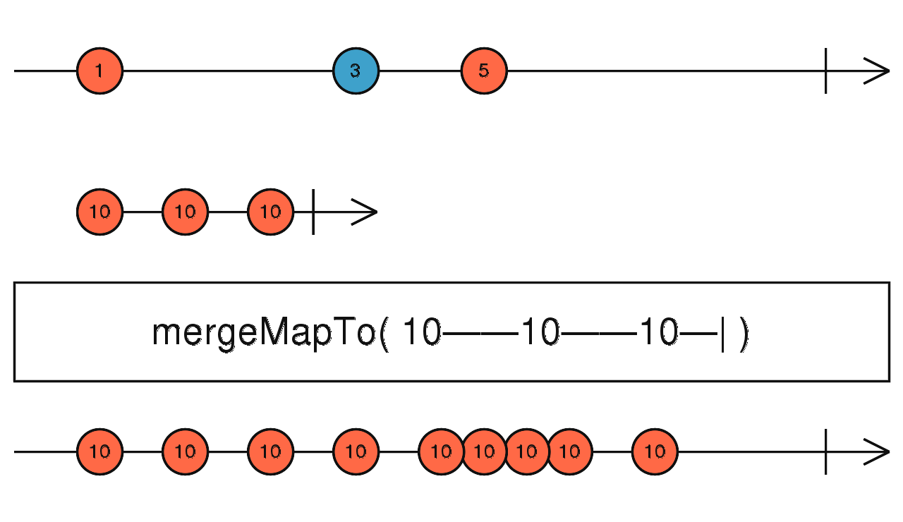

**使用介面**

```typescript
 mergeMapTo(innerObservable: ObservableInput, resultSelector: function(outerValue: T, innerValue: I, outerIndex: number, innerIndex: number): any, concurrent: number): Observable
```

**使用範例**

```typescript
Observable.of(1,2,3,4,5)
    .mergeMapTo(
        Observable.of('Hi'),
        (outerValue, innerValue) => {
          return innerValue + ' ' + outerValue;
        })
    .subscribe(value => console.log(value)); // 輸出: Hi 1, Hi 2, Hi 3, Hi 4, Hi 5
```

## switchMap

取最新發生的資料合併兩個 Observable 並做轉換

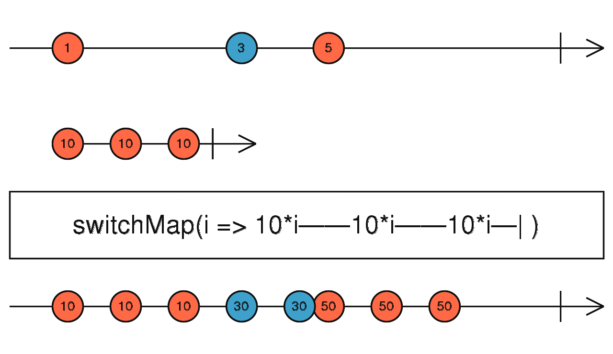

**使用介面**

```typescript
switchMap(project: function(value: T, ?index: number): ObservableInput, resultSelector: function(outerValue: T, innerValue: I, outerIndex: number, innerIndex: number): any): Observable
```

**使用範例**

```typescript
const clicks = Rx.Observable.fromEvent(document, 'click');
const result = clicks.switchMap((ev) => Rx.Observable.interval(1000));
result.subscribe(x => console.log(x));
```

在每一次 click 動作重新執行 Observable.interval 的動作

## switchMapTo

就跟 `switchMap` 一樣，只是每次都回傳一樣的值


**使用介面**

```typescript
switchMapTo(innerObservable: ObservableInput, resultSelector: function(outerValue: T, innerValue: I, outerIndex: number, innerIndex: number): any): Observable
```

**使用範例**

```typescript
var clicks = Rx.Observable.fromEvent(document, 'click');
var result = clicks.switchMapTo(Rx.Observable.interval(1000));
result.subscribe(x => console.log(x));
```

## exhaustMap

如果在上一個 Observable 動作未完成，又發生另一個 observable 動作，則這一個動作會被忽略。


**使用介面**

```typescript
exhaustMap(project: function(value: T, ?index: number): ObservableInput, resultSelector: function(outerValue: T, innerValue: I, outerIndex: number, innerIndex: number): any): Observable
```

**使用範例**

```typescript
var clicks = Rx.Observable.fromEvent(document, 'click');
var result = clicks.exhaustMap(Rx.Observable.interval(1000));
result.subscribe(x => console.log(x));
```

## expand

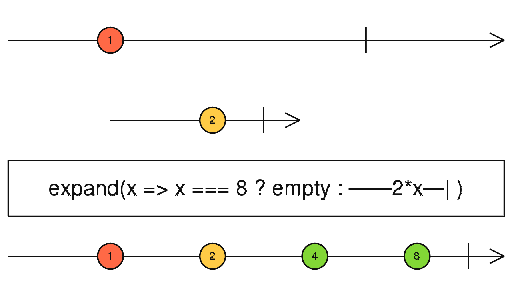

**使用介面**

```typescript
expand(project: function(value: T, index: number), concurrent: number, scheduler: Scheduler): Observable
```

**使用範例**

```typescript
Observable.of(1, 2)
    .expand((value: number) => {
      if (value === 8)
        return Observable.empty();
      else
        return Observable.of(value * 2);
    })
    .subscribe(x => console.log(x)); // 輸出 1, 2, 4, 8, 2, 4, 8
```

## groupBy

根據條件將資料群組化輸出成獨立的 Observable

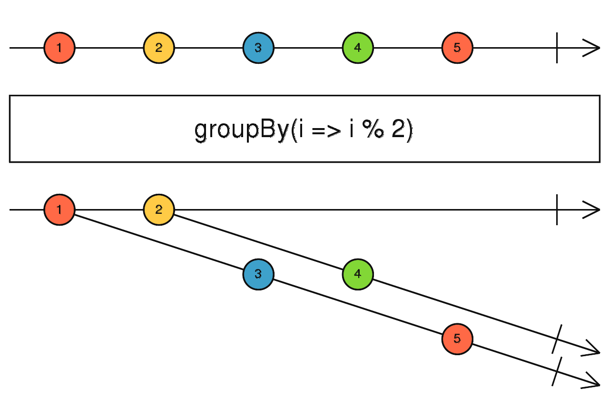

**使用介面**

```typescript
GroupBy(keySelector: function(value: T): K, elementSelector: function(value: T): R, durationSelector: function(grouped: GroupedObservable<K, R>): Observable<any>): Observable<GroupedObservable<K, R>>
```

**使用範例**

```typescript
const data = [1, 2, 3, 4, 5];
let groupData = [];
Observable.from(data).groupBy(x => x % 2, (ele)=> ele + '!').subscribe(g => {
  let group = {key: g.key, values: []};
  g.subscribe(value => {
    group.values.push(value);
  });
  groupData.push(group);
});
if (groupData) {
  console.log(groupData); // 輸出: [{key: 1, values: [1!, 3!, 5!]}, {key: 2, values: [2!, 4!]}]
}
```

## mergeScan

執行 scan 動作時，會回傳一個 observable 並與 outer observable 做 merge

**使用介面**

```typescript
mergeScan(accumulator: function(acc: R, value: T): Observable<R>, seed: *, concurrent: number): Observable<R>
```

**使用範例**

```typescript
const data = [1, 2, 3, 4, 5];
Observable.from(data)
    .mergeScan((acc, one) => Observable.of(acc + one), 0)
    .subscribe(value => console.log(value)); // 輸出: 1, 3, 6, 10, 15
```

## pairwise

將前一次與本次發生的資料合併輸出

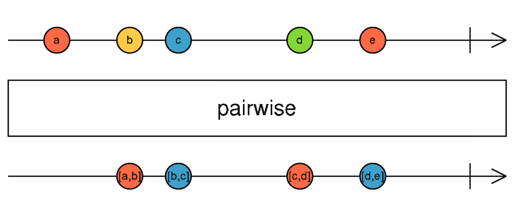

**使用介面**

```typescript
pairwise(): Observable<Array<T>>
```

**使用範例**

```typescript
const data = [1, 2, 3, 4, 5];
Observable.from(data)
          .pairwise()
          .subscribe(value => {
  			console.log(value); // 輸出: [1,2], [2,3], [3,4], [4,5]
          });
```

## partition

根據條件分成符合與不符合條件的兩組 Observable

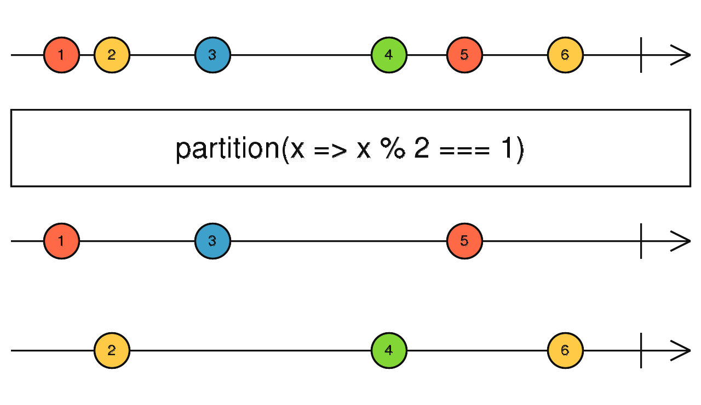

**使用介面**

```typescript
partition(predicate: function(value: T, index: number): boolean, thisArg: any): [Observable<T>, Observable<T>]
```

**使用範例**

```typescript
const data = [1, 2, 3, 4, 5];
let parts = Observable.from(data).partition(x => x % 2 === 1);
parts[0].subscribe(value => {
  console.log(value); // 輸出: 1, 3, 5
});
parts[1].subscribe(value => {
  console.log(value); // 輸出: 2, 4
});
```

## pluck

取出特定的屬性，可以透過第二，及第三引數等，取得更深層的屬性

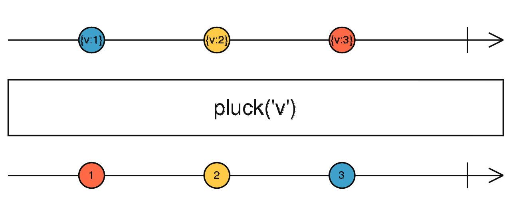

**使用介面**

```typescript
 pluck(properties: ...string): Observable
```

**使用範例**

```typescript
import 'rxjs';
import {Observable} from 'rxjs/Observable';

const data = [{name: 'a', sex: 1}, {name: 'b', sex: 1}, {name: 'c', sex: 0}]

Observable.from(data)
          .pluck('name')
          .subscribe(value => console.log(value)); // 輸出: a, b, c
```

```typescript
import 'rxjs';
import {Observable} from 'rxjs/Observable';

const data = [
  {
    id: 1,
    company: {
      name: 'Romaguera-Crona',
      catchPhrase: 'Multi-layered client-server neural-net',
      bs: 'harness real-time e-markets'
    }
  },
  {
    id: 2,
    company: {
      name: 'Deckow-Crist',
      catchPhrase: 'Proactive didactic contingency',
      bs: 'synergize scalable supply-chains'
    }
  },
  {
    id: 3,
    company: {
      name: 'Romaguera-Jacobson',
      catchPhrase: 'Face to face bifurcated interface',
      bs: 'e-enable strategic applications'
    }
  }
];

Observable.from(data)
    .pluck('company', 'name')
    .subscribe(value => {
       console.log(value); // 輸出: Romaguera-Crona, Deckow-Crist, Romaguera-Jacobson
    }); 
```

## scan

類似 JavaScript 的 reduce，每次都會輸出計算後的值，且保留之前的狀態

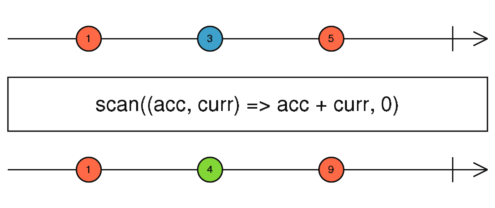

**使用介面**

```typescript
scan(accumulator: function(acc: R, value: T, index: number): R, seed: T | R): Observable<R>
```

**使用範例**

```typescript
const subScan = new Subject();
subScan.scan((acc: number, one: number) => acc + one, 0)
    .subscribe(value => console.log(value));
subScan.next(1); // 輸出: 1
subScan.next(1); // 輸出: 2
```

## buffer

根據 Observable 條件決定緩衝空間，當緩衝空間滿時，則輸出資料

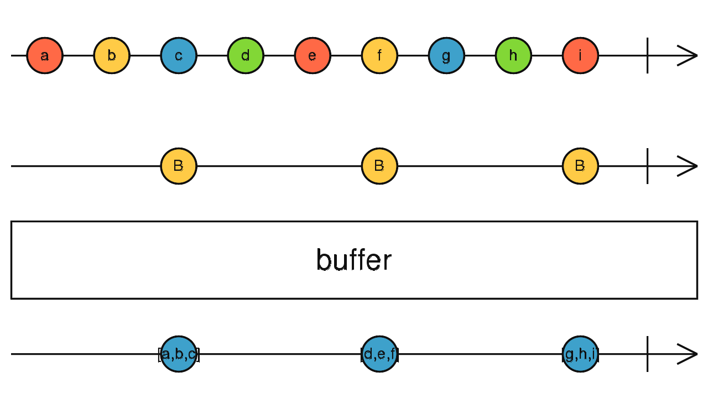

**使用介面**

```typescript
buffer(closingNotifier: Observable<any>): Observable<T[]>
```

**使用範例**

```typescript
Observable.interval(250)
    .take(10)
    .buffer(Observable.interval(1000))
    .subscribe(value => console.log(value)); // 輸出：[0,1,2], [3,4,5,6]
```

## bufferCount

根據資料數量條件決定緩衝空間，當緩衝空間滿時，則輸出資料

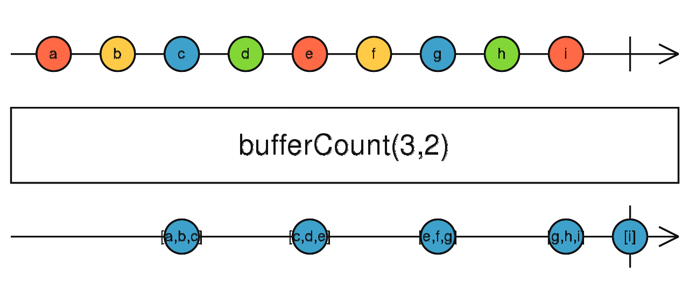

**使用介面**

```typescript
bufferCount(bufferSize: number, startBufferEvery: number): Observable<T[]>
```

**使用範例**

```typescript
Observable.interval(300)
    .take(10)
    .bufferCount(3)
    .subscribe(value => console.log(value)); // 輸出: [0,1,2], [3,4,5],[6,7,8],[9]

Observable.interval(300)
    .take(10)
    .bufferCount(3,2)
    .subscribe(value => console.log(value)); // 輸出: [0,1,2], [2,3,4],[4,5,6],[6,7,8].[8,9]
```

## bufferTime

根據時間條件決定緩衝空間，當緩衝空間滿時，則輸出資料

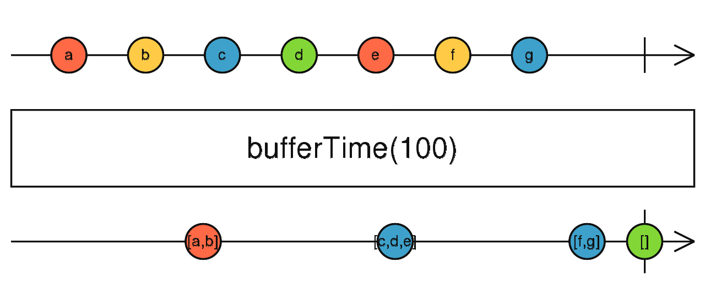

**使用介面**

```typescript
bufferTime(bufferTimeSpan: number, bufferCreationInterval: number, maxBufferSize: number, scheduler: Scheduler): Observable<T[]>
```

**使用範例**

```typescript
Observable.interval(300)
    .take(10)
    .bufferTime(1000)
    .subscribe(value => console.log(value));
```

## bufferToggle

根據開始與結束開關決定緩衝空間，當緩衝空間滿時，則輸出資料

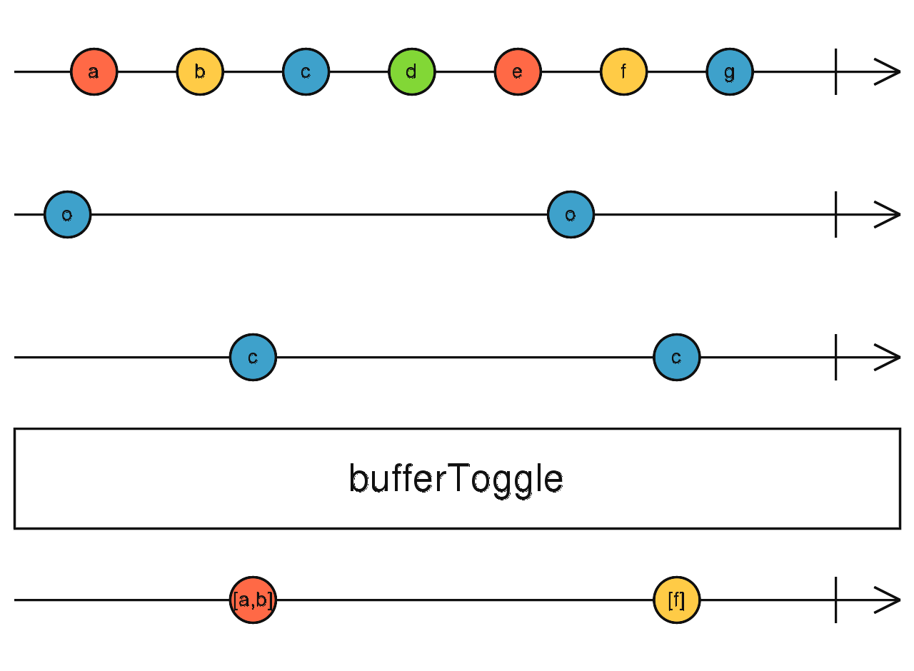

**使用介面**

```typescript
bufferToggle(openings: SubscribableOrPromise<O>, closingSelector: function(value: O): SubscribableOrPromise): Observable<T[]>
```

**使用範例**

```typescript
// 0123456789
//    oc  oc
Observable.interval(250)
    .take(10)
    .bufferToggle(Observable.interval(1000), x => Observable.interval(500))
    .subscribe(value => console.log(value)); // 輸出： [3,4],[7,8]
```

## bufferWhen

根據結束開關決定緩衝空間，當緩衝空間滿時，則輸出資料

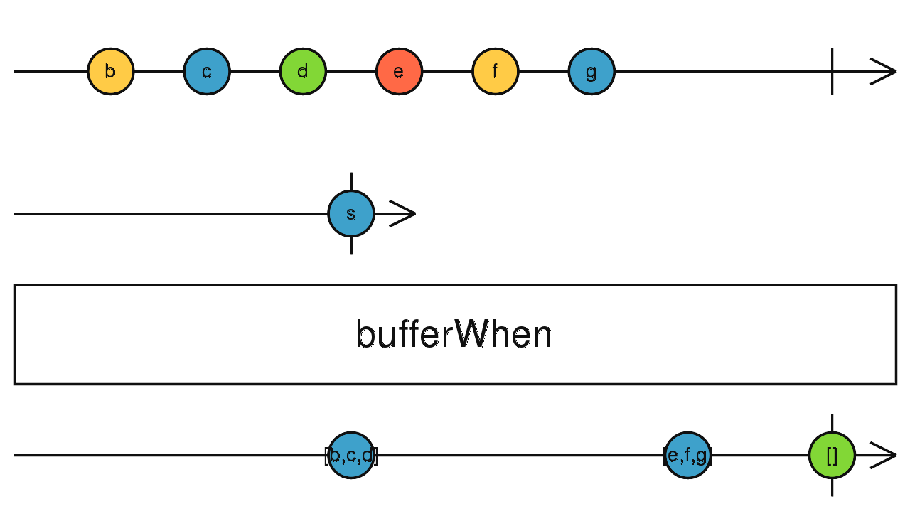

**使用介面**

```typescript
bufferWhen(closingSelector: function(): Observable): Observable<T[]>
```

**使用範例**

```typescript
Observable.interval(250)
    .take(10)
    .bufferWhen(() => Observable.interval(1000))
    .subscribe(value => console.log(value)); // 輸出：[0,1,2],[3,4,5,6],[7,8,9]
```

## window

根據 Observable 條件決定緩衝空間，當緩衝空間滿時，則輸出包含緩衝資料的新Observable

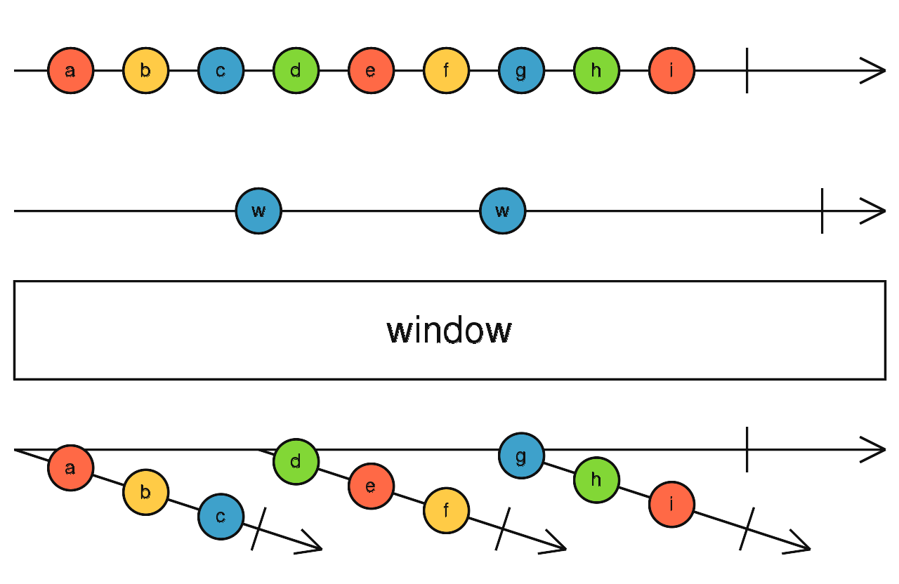

**使用介面**

```typescript
window(windowBoundaries: Observable<any>): Observable<Observable<T>>
```

**使用範例**

```typescript
let i = 0;
let groupsData = [];
Observable.interval(250)
    .take(10)
    .window(Observable.interval(1000))
    .subscribe(value => {
      let group = {groupId: ++i, values: []};
      value.forEach(v => group.values.push(v));
      groupsData.push(group);      
    });
```

## windowCount

根據資料數量條件決定緩衝空間，當緩衝空間滿時，輸出包含緩衝資料的新Observable

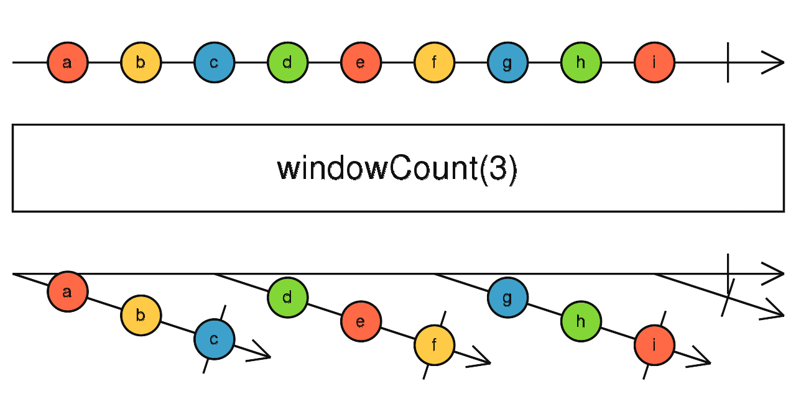

**使用介面**

```typescript
windowCount(windowSize: number, startWindowEvery: number): Observable<Observable<T>>
```

**使用範例**

```typescript
let i = 0;
let groupsData = [];
Observable.interval(250)
    .take(10)
    .windowCount(3)
    .subscribe(value => {
      let group = {groupId: ++i, values: []};
      value.forEach(v => group.values.push(v));
      groupsData.push(group);      
    });
```


## windowTime

根據時間條件決定緩衝空間，當緩衝空間滿時，輸出包含緩衝資料的新Observable

**使用介面**

```typescript
windowTime(bufferTimeSpan: number, bufferCreationInterval: number, maxBufferSize: number, scheduler: Scheduler): Observable<Observable<T>>
```

**使用範例**

```typescript
let i = 0;
let groupsData = [];
Observable.interval(250)
    .take(10)
    .windowTime(1000)
    .subscribe(value => {
      let group = {groupId: ++i, values: []};
      value.forEach(v => group.values.push(v));
      groupsData.push(group);
      console.log(groupsData);
    });
```

## windowToggle

根據開始與結束開關決定緩衝空間，當緩衝空間滿時，輸出包含緩衝資料的新Observable

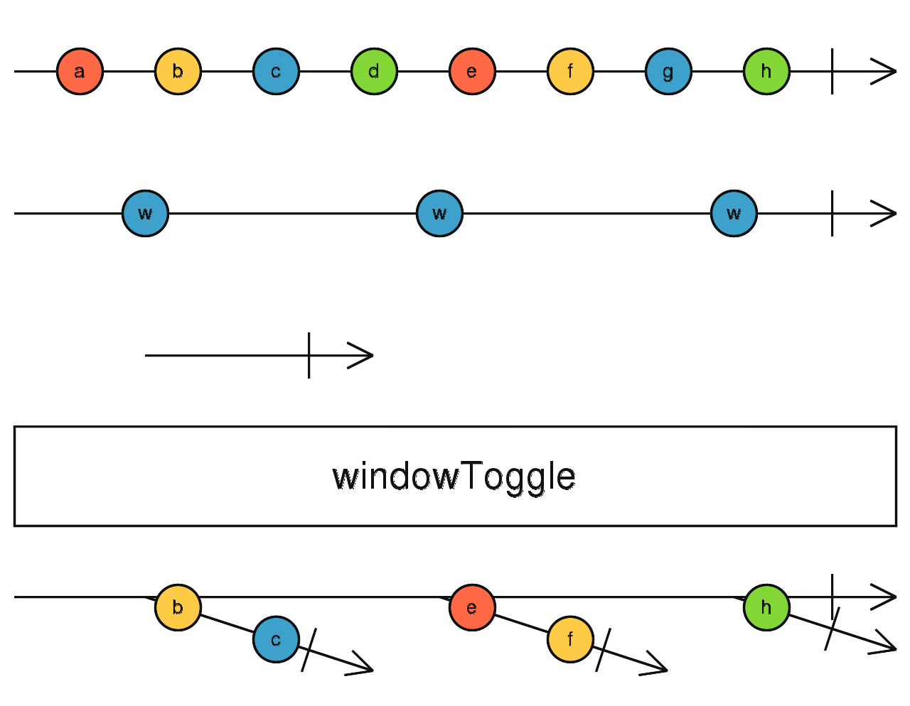

**使用介面**

```typescript
windowToggle(openings: Observable<O>, closingSelector: function(value: O): Observable): Observable<Observable<T>>
```

**使用範例**

```typescript
let i = 0;
let groupsData = [];
Observable.interval(250)
    .take(10)
    .windowToggle(Observable.interval(1000), x => Observable.interval(500))
    .subscribe(value => {
      let group = {groupId: ++i, values: []};
      value.forEach(v => group.values.push(v));
      groupsData.push(group);
      console.log(groupsData);
    });
```

## windowWhen

根據結束開關決定緩衝空間，當緩衝空間滿時，輸出包含緩衝資料的新Observable

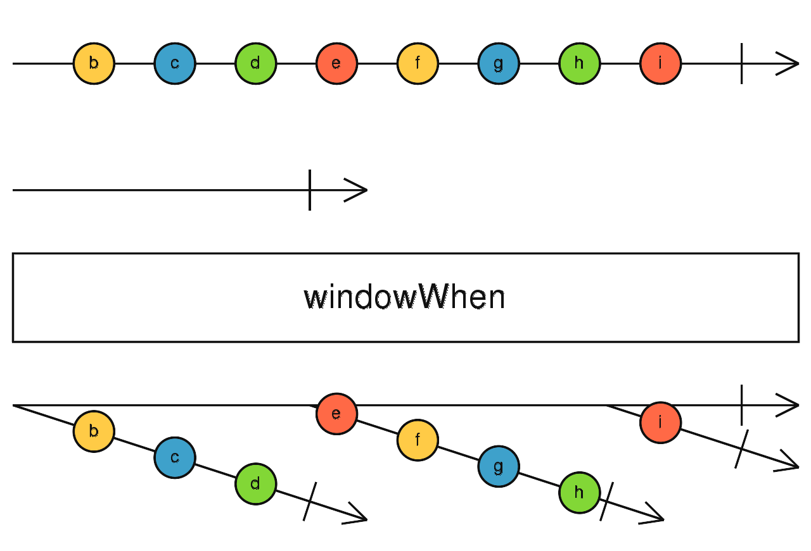

**使用介面**

```typescript
windowWhen(closingSelector: function(): Observable): Observable<Observable<T>>
```

**使用範例**

```typescript
let i = 0;
let groupsData = [];
Observable.interval(250)
    .take(10)
    .windowWhen(()=> Observable.interval(1000))
    .subscribe(value => {
      let group = {groupId: ++i, values: []};
      value.forEach(v => group.values.push(v));
      groupsData.push(group);
      console.log(groupsData);
    });
```

