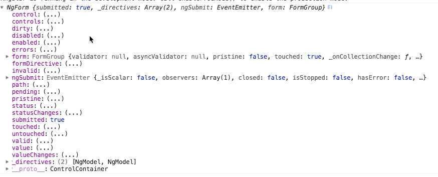

# Template Driven Form

有寫過 AngularJS 的人一定知道 `ng-model` 這讓人又愛又恨的功能，雙向繫結允許我們可以很簡單的收集表單上的資料，同樣的效果不同的實踐方式，一樣存活在 Angular 的框架裡，搭配 `[(ngModel)]` 就可以完成雙向繫結的效果，但是這裡就不探討底層的運作原理，Angular 內的雙向繫結沒有 AngularJs 效能上的問題，可以安心使用

```html
<input type="text" [(ngModel)]="firstName" />
```

`NgModel` 在 Angular 裡面有另外一個功能，那就是賦予 Form Element 擁有 FormControl 的功能

```html
<input type="text" name="firstName" ngModel #firstName="ngModel" />
```

透過樣版變數取得 NgModel 物件，所取得的物件本身具有 FormControl 的所有功能及特性，包括驗證狀態，資料等

表單當然不可能這麼簡單，以下是一個簡單又很常見的登入表單

```html
<form #f="ngForm" (ngSubmit)="login(f)" novalidate>
  <label for="username">UserName</label>
  <input type="text" name="username" [(ngModel)]="userInfo.username" />
  <label for="password">Password</label>
  <input type="password" name="password" [(ngModel)]="userInfo.password" />
  <button type="submit">Login</button>
</form>
```

或是透過 ngForm 取得資料

```html
<form #f="ngForm" (ngSubmit)="login(f)" novalidate>
  <label for="username">UserName</label>
  <input type="text" name="username" ngModel required />
  <label for="password">Password</label>
  <input type="password" name="password" ngModel required/>
  <button type="submit">Login</button>
</form>

```

這兩者都可以取得表單上所輸入的資料

`ngForm` 會產生一個最上層的 FormGroup ，FormGroup 下會涵括所有的 FormControl 跟子FormGroup，之後將 範本變數所接受的 FormGroup 物件傳到 Component Class 時，就可以取得畫面上表單資料及表單的驗證狀態等資訊



上圖列出 FormGroup 有的屬性與方法可供使用

* control：是取得自己的狀態
* controls：FormGroups 所包含的 FormControls
* dirty： 資料使否有異動
* disabled：停用狀態
* enabled：啟用狀態
* errors：FormControl 的錯誤訊息
* valid：是否通過所有的驗證規則
* value：FormControp 下 FormControls/FormGroups 的資料集
* valueChanges：可持續監控 FormGroups/FormControls 值的變化
* statusChanges: 可持訊監控 FormGroups/FormControls 狀態的變化